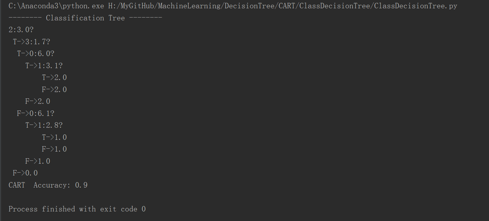
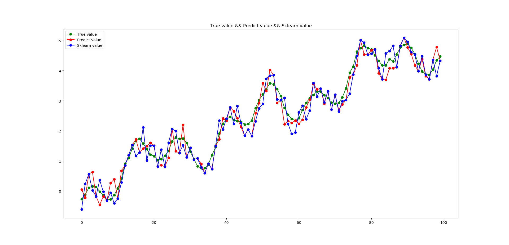
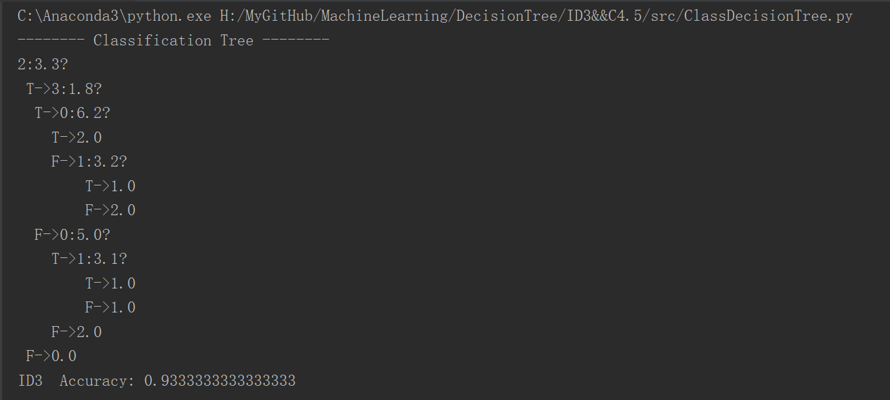

# 决策树算法

算法分为三步：

1. 特征选择：选择划分数据集的特征种类以及特征相应的阈值(连续型特征可取多个值，离散型特征也可取多个值)

2. 生成决策树

3. 决策树剪枝

这里我们设置了特征选择的阈值来替代决策树剪枝，即当信息增益或信息增益比小于该阈值时，就不再对数据集进行拆分，不再生成新节点；当基尼指数或平方误差损失仍小于该阈值时，则不再进行拆分。

# CART分类与回归树

## CART分类树:以基尼指数最小的特征为拆分节点的属性

运行`./CART/ClassDecisionTree/ClassDecisionTree.py`得到的结果如下，下图展示了生成的树结构和分类结果：

## CART回归树:以平方误差损失MSE最小的特征为拆分节点的属性

运行`./CART/RegressionDecisionTree/RegressionDecisionTree.py`,下图我们展示了真实结果，我们模型预测的结果以及`sklearn`自带的回归树的结果：

# ID3&&C4.5分类树

## ID3算法：以信息增益最大的特征为拆分节点的属性

运行`ID3&&C4.5/src/ClassDecisionTree.py`, 算法的运行结果，展示的是生成的树和分类结果，如图所示：

## C4.5算法：以信息增益比最大的特征为拆分节点的属性

运行`ID3&&C4.5/src/ClassDecisionTree.py`,算法的运行结果，展示的是生成的树和分类结果，如图所示：

# 分类树与回归树在特征选择方面的相同和差异

## 相同

分类树和回归树在特征选择时，不仅要比较不同的特征，还要比较特征下不同的阈值的结果，连续型特征和离散型特征都需要考虑

## 差异

分类树中，先前节点已经使用过的特征，会从特征选择序列中删除；回归树并不会删除，但会选择特征的不同切分点。