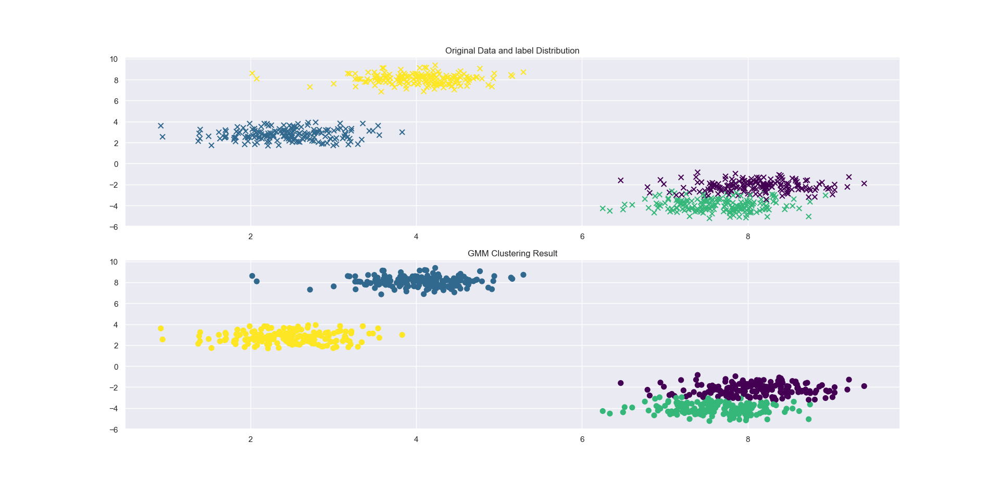
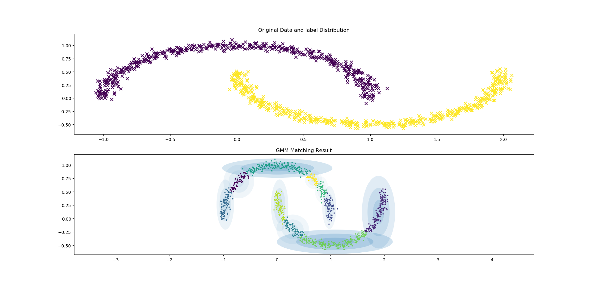

# 高斯混合模型GMM(EM算法实现)

算法实现 基于李航《统计学习方法》第二版186页

## GMM.PY方法介绍

1. fit 方法

用来训练聚类模型，返回每条数据属于各个类别的概率

2. predict 方法

基于训练好的GMM模型，来预测新数据的类别及其概率，返回每条数据属于各个类别的概率

## 聚类效果

运行`src/Example2.py`:

## 用GMM来拟合一个分布，方式仍是通过聚类

运行`src/Example.py` ：

上述例子中，我们用10个分模型来拟合数据分布，也就是说我们可以通过拟合得到的分布来生成类似原数据的分布数据，10个分模型的含义是聚类形成10个簇。

## TODO

用高斯混合模型来生成新数据