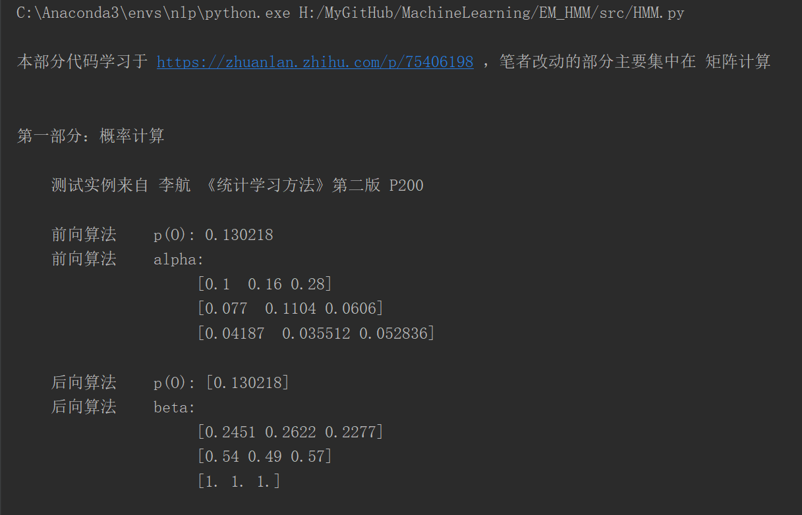
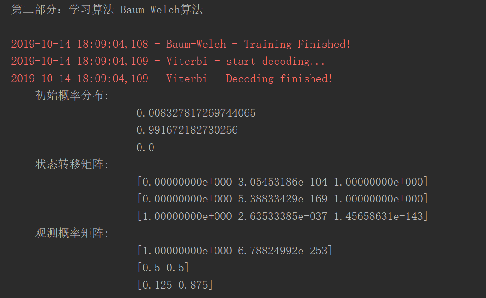
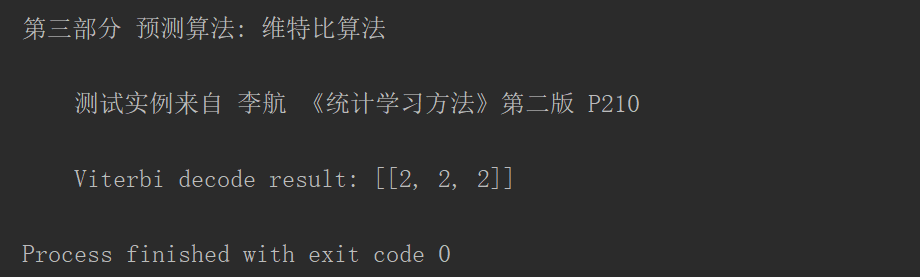

# 隐马尔可夫模型HMM

隐马尔可夫模型是关于时序的概率模型，描述由一个**隐藏的马尔可夫链** 随机生成 **不可观测的状态随机序列**，再由各个状态生成一个观测 从而产生 **观测随机序列** 的过程。

## 1. 概率计算算法

### 前向概率算法

`./src/HMM.py` 的 forward方法里实现

### 后向概率算法

`./src/HMM.py` 的 backward方法里实现

## 2. 学习算法：Baum-Welch，用于无监督学习

鲍姆-韦尔奇算法基于EM算法实现，是用来学习隐马尔可夫模型的三个参数：初始概率矩阵、状态转移概率矩阵和观测概率矩阵(发射矩阵)，在代码`./src/HMM.py` 的 baum_welch方法里实现。

## 3. 预测算法：维特比算法

`./src/HMM.py` 的 viterbi方法里实现

## 4. 结果

运行 `./src/HMM.py` ，结果为：

## 5. 实际运用

### 分词：有监督学习和无监督学习

[HMM分词应用](https://github.com/damo894127201/WordSegmentation)

### 词性标注