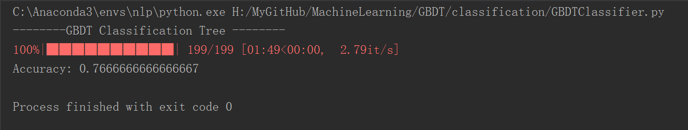

# GBDT 梯度提升决策树(Gradient Boosting Decision Tree)

无论是用于分类的GBDT，还是用于回归的GBDT，其基函数(每棵树)都是CART回归树。

分类与回归在GBDT模型上并无多大区别，差异体现在：
分类时，将输出的多维值(即每个类别的概率)用softmax转为概率，再输出概率最大的索引对应的类别；回归时，直接输出每棵树预测值的加总即可,每棵树的预测值维度为`(n_samples,1)`。

分类时，y输入是`[label,label,...]`，但在进入GBDT模型前，会转换为one-hot编码，即`[1,0,2,1]`转换为`[[0,1,0],[0,0,0],[0,0,1],[0,1,0]]` 

回归时，y输入是`[value,value,...]`

X的输入都是`np.array([[value,value,...],...])`

## 用于分类的GBDT

运行程序`classification/GBDTClassifier.py`，结果如下:

## 用于回归的GBDT

运行程序`Regression/GBDTRegressor.py`

蓝线是用sklearn的tree.DecisionTreeRegressor()预测的结果，红线是我们的模型预测结果