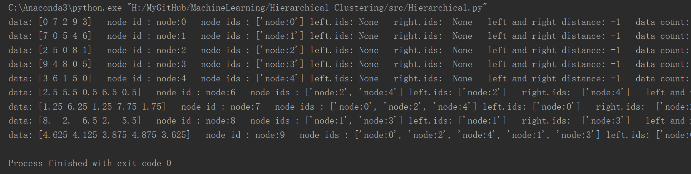
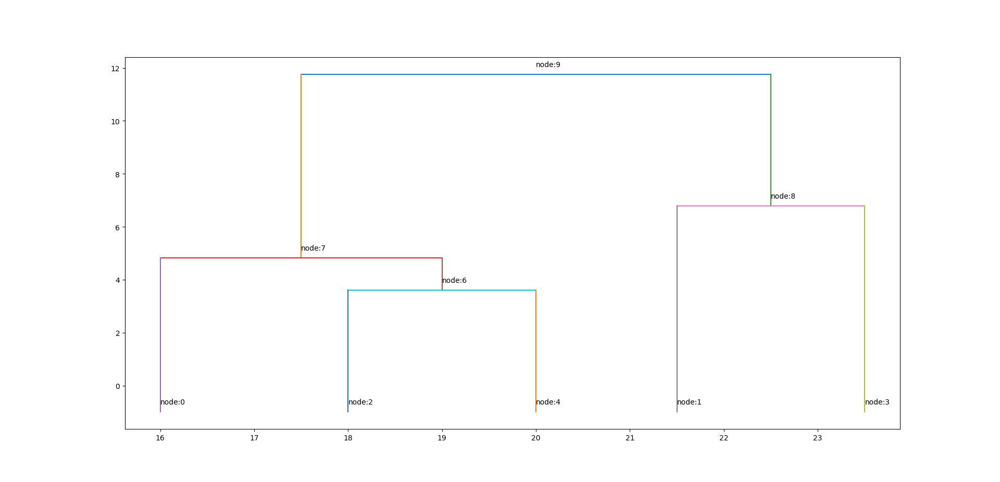
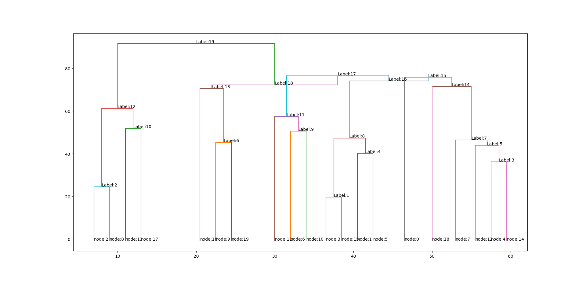

# 层次聚类: Hierarchical Clustering

## 聚合聚类(自下而上聚类)

运行`src/Hierarchical.py` 得:

聚类树如下:

随机生成20个数据的聚类树如下：

之所以出现有些水平线低于垂直线，导致层次性不那么明显，是由于，我们是从根节点开始绘图，结点的纵坐标取的是当前结点中，左右子节点的距离。一般来说，这个结点从根节点下来，逐渐递减，因为聚类是自下而上，每次选取的都是距离最小的结点代表的类进行归并。但是，当前轮次的归并，最小的距离不一定就大于上轮次的最小的距离，因为上一轮次生成了新的结点。

## 分裂聚类(自上而下聚类)

此处略去