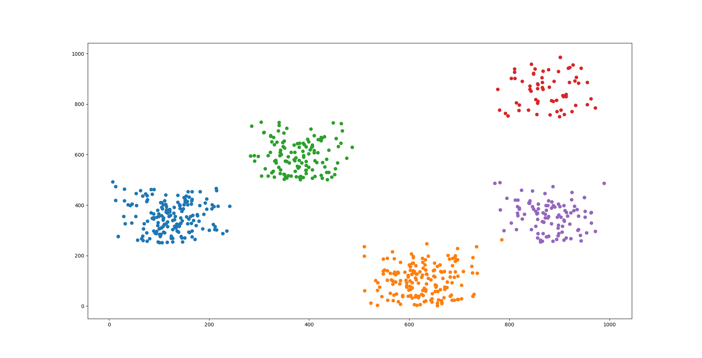
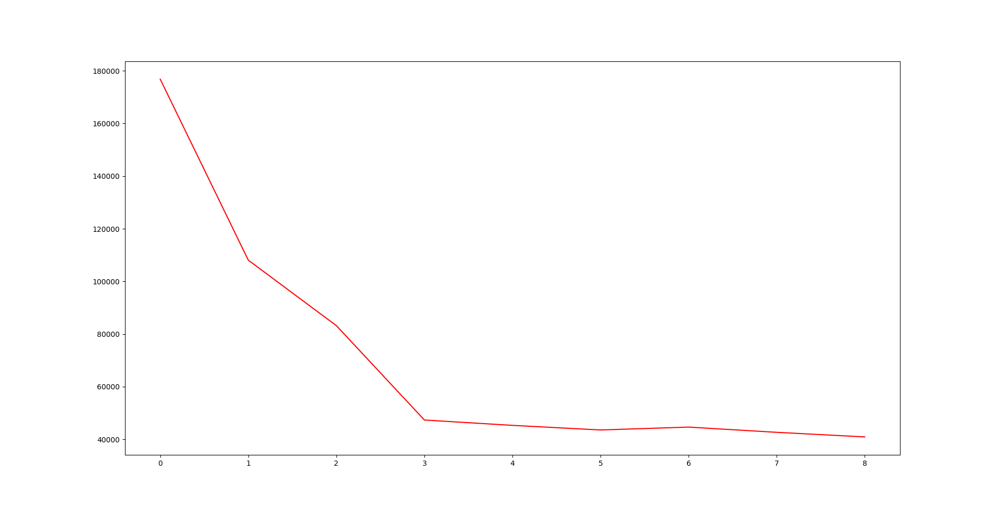
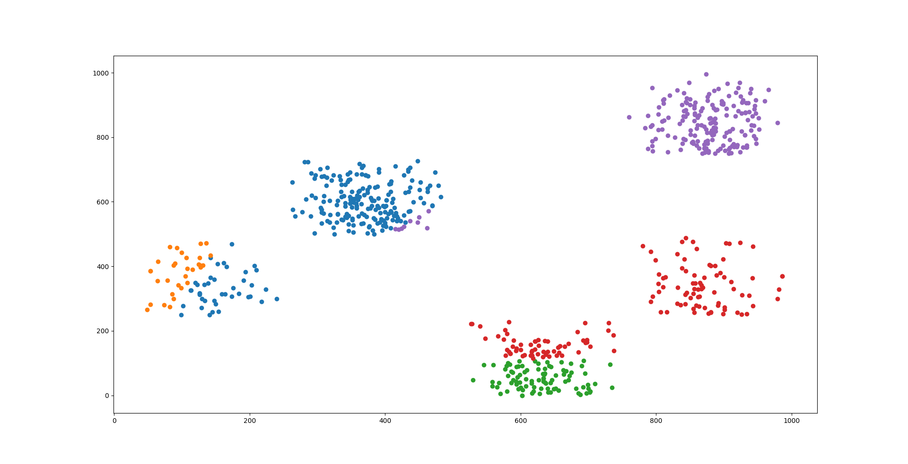
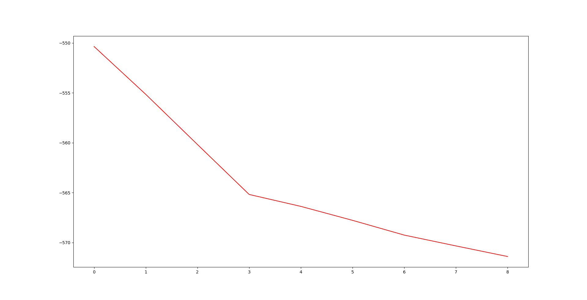

# src目录介绍

## 1. Kmeans_distance.py

基于空间距离实现的KMeans聚类算法，聚类结果如下：

## 2. SelectK_distance.py

确定聚类类别K的SSE-K曲线图，如下:

## 3. Kmeans_cosine.py

基于余弦相似度实现的KMeans聚类算法，聚类结果如下：

## 4. SelectK_Cosine.py

确定聚类类别K的SSE-K曲线图，如下:

## 5. compare.py

比较sklearn实现的KMeans与编写的KMeans的代码。

# 相似度度量

## 1. 空间距离

用距离来度量两点之间的相似度，距离越小，两点越相似。常用的距离度量有：曼哈顿距离(CityBlock Distance,也叫城市街区距离)，欧氏距离(Euclidean Distance)，闵式距离(Minkowski Distance)。当 lambda=1时，闵式距离就是曼哈顿距离；当 lambda=2时，闵式距离就是欧式距离。

## 2. 余弦相似度

用空间中两个点之间的余弦值表示两点的相似度，余弦值越大，两点越相似。

# 基于空间距离实现KMeans聚类算法

## 1. 算法思想

首先选择K个中心点，然后将每个样本点分配到距离其最近的中心点，之后更新每个簇的中心点；如果相邻两次聚类 每个簇的中心点不变，则停止，否则循环下去；

## 2. 算法流程

	1. 选定要聚类的类别数目K
	2. 选择K个中心点
	3. 针对每个样本点，找到距离其最近的中心点，距离同一中心点最近的点为一个类簇，这样便完成一次聚类
	4. 判断聚类前后的样本点的类别情况是否相同，如果相同，则算法停止，否则进入step5
	5. 针对每个类簇中的样本点，计算这些样本点的中心点，当做该簇的新中心点，继续step3
	
## 3. 算法关键点

### 1. 初始聚类中心的选择

#### 1) 随机选择，效果不理想

#### 2) 选择彼此距离尽可能远的K个点作为初始中心点：
	1. 计算所有样本点之间的距离，选择距离最大的一个点对(两个样本a,b),从样本点集中删除这两个点；
	2. 从剩余点中计算每个点距离已知聚类中心点的最近距离(比如某个点与a最近，某个点与b最近)，然后排序距离，选择距离最远的那个点；
	3. 以此类推，直至选出满足K个初始类簇的中心点；

### 2. K值的选择

#### 拐点法(手肘法)：
	1. 画出不同K值的 类内距离/类间距离-K的曲线，值越小聚类结果越好，选择图中的拐点处；
	2. 画出不同K值的 SSE-K(误差平方和)，值越小聚类结果越好，选择图中的拐点处；
	3. SSE是误差平方和，它是所有样本点到它所在聚类中心点的距离之和；

# 基于余弦相似度实现KMeans聚类算法

## 1. 算法思想

首先选择K个中心点，然后将每个样本点分配到与其余弦相似度最大的中心点(越相似的点在一起)所在的类别，之后更新每个簇的中心点；如果相邻两次聚类 每个簇的中心点不变，则停止，否则循环下去；

## 2. 算法流程

	1. 选定要聚类的类别数目K
	2. 选择K个中心点
	3. 针对每个样本点，找到与其余弦相似度最大的中心点；与同一中心点余弦相似度最大的点为一个类簇，这样便完成一次聚类
	4. 判断聚类前后的样本点的类别情况是否相同，如果相同，则算法停止，否则进入step5
	5. 针对每个类簇中的样本点，计算这些样本点的中心点，当做该簇的新中心点，继续step3

## 3. 算法关键点

### 1. 初始聚类中心的选择

#### 1) 随机选择，效果不理想

#### 2) 选择彼此最不相似(余弦值最小)的K个点作为初始中心点：

	1. 计算所有样本点之间的余弦相似度，选择最不相似的一个点对(两个样本a,b),从样本点集中删除这两个点；
	2. 从剩余点中计算每个点与已知聚类中心点的余弦相似度的最大值(比如，相对而言，某个点与a最相似，某个点与b最相似)，
	3. 然后排序余弦相似度，选择余弦相似度最小的那个点；
	4. 以此类推，直至选出满足K个初始类簇的中心点；

### 2. K值的选择

#### 拐点法(手肘法)：
	1. 画出不同K值的 类内距离/类间距离-K的曲线，值越小聚类结果越好，选择图中的拐点处；
	2. 画出不同K值的 SSE-K(误差平方和)，值越小聚类结果越好，选择图中的拐点处；
	3. SSE是误差平方和，它本是所有样本点到它所在聚类中心点的距离之和，这里改为所有样本点与它所在聚类中心的余弦相似度之和的负值；

# 聚类算法性能的评估

## 1. 评估指标

### 1)ARI(Adjusted Rand Index): 调整兰德指数(具体看`./post/文件里的博客和论文`)

该指标适用于**有标注类别**的数据集。

#### Rand Index: 兰德指数

兰德指数需要给定实际类别信息C，假设K是聚类结果，a 表示在C与K中都是同类别的元素对数，b表示在C与K中都是不同类别的元素对数，则兰德指数为：

$$RI = \frac{a + b}{C_{2}^{n_{samples}}}$$

其中 $C_{2}^{n_{samples} $ 是数据集中可以组成的总元素对数，RI取值范围为[0,1]，值越大意味着聚类结果与真实情况越吻合。

#### Adjusted Rand Index：调整兰德指数

对于随机结果，RI 并不能保证分数接近0。为了实现“在聚类结果随机产生的情况下，指标应该接近0”，调整兰德指数被提出，计算方式为：

$$ARI = \frac{RI - E[RI] }{max(RI) - E[RI] } $$

ARI的取值范围为[-1,1]，值越大意味着聚类结果与真实情况越吻合。从广义的角度来讲，ARI衡量的是两个数据分布的吻合程度，这与互信息的作用相同。因此，互信息也可以用于衡量有标注类别的数据集的聚类性能。

sklearn已经实现了调整兰德指数，如下：

	from sklearn import metrics

	labels_true = [0,0,0,1,1,1]
	labels_pred = [0,0,1,1,2,2]

	metrics.adjusted_rand_score(labels_true,labels_pred)

#### 相关资料

Ka Yee Yeung, Walter L. Ruzzo . Details of the Adjusted Rand index and Clustering algorithms Supplement to the paper “An empirical study on Principal Component Analysis for clustering gene expression data” (to appear in Bioinformatics)

### 2)Mutual Information(MI): 互信息

### 3)Silhouette Coefficient: 轮廓系数

该指标适用于**无标注类别**的数据集。

对于单个样本，设 a 是与它同类别中其他样本的平均距离， b 是与它距离最近的不同类别中样本的平均距离，轮廓系数为：

$$ S = \frac{b - a }{max(a,b)}$$

对于一个样本集合，它的轮廓系数是所有样本轮廓系数的平均值。轮廓系数的取值范围是 [-1,1] ,同类别样本距离越相近且不同类别样本距离越远，则轮廓系数分数越高，聚类效果越好。

sklearn已经实现了轮廓系数的计算，使用方式如下：

假设X表示样本集合，labels表示聚类后每个样本的类别

	from sklearn.cluster import KMeans
	from sklearn import metrics

	model = KMeans(n_clusters=3,random_state=1).fit(X)
	labels = model.labels_

	metrics.silhouette_score(X,labels,metric='euclidean')

## 2. 与sklearn.cluster.KMeans算法对比

### 1)数据集：西瓜数据集4.0 和 自定义数据集

数据集来源于周志华西瓜书的西瓜数据集，包含三列：编号、密度和含糖量。数据存放在`./data/watermelon4.0.csv`。

自定义数据集：数据生成过程可查看`src/compare.py`

### 2)比较结果

|方法|聚类个数|西瓜数据集:轮廓系数|自定义数据集|
|:---|:---:|---:|--:|
|sklearn.cluster.KMeans|3|0.42|0.61|
|Kmeans_distance|3|0.34|0.58|
|Kmeans_cosine|3|0.14|0.39|
||
|sklearn.cluster.KMeans|4|0.46|0.7|
|Kmeans_distance|4|0.38|0.7|
|Kmeans_cosine|4|0.13|0.44|
||
|sklearn.cluster.KMeans|5|0.44|0.74|
|Kmeans_distance|5|0.33|0.7|
|Kmeans_cosine|5|0.07|0.39|

显然，sklearn实现的KMeans效果更好。

