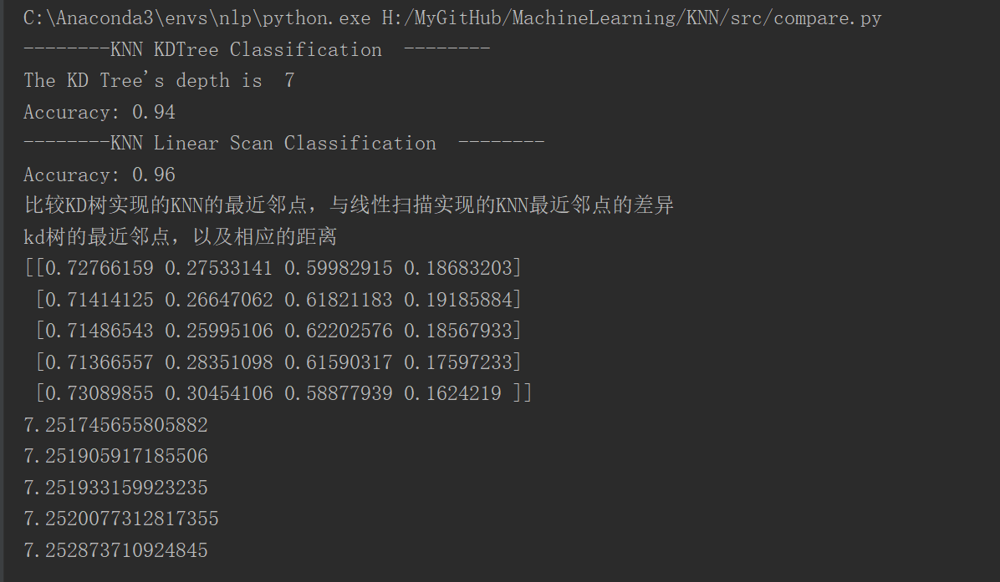
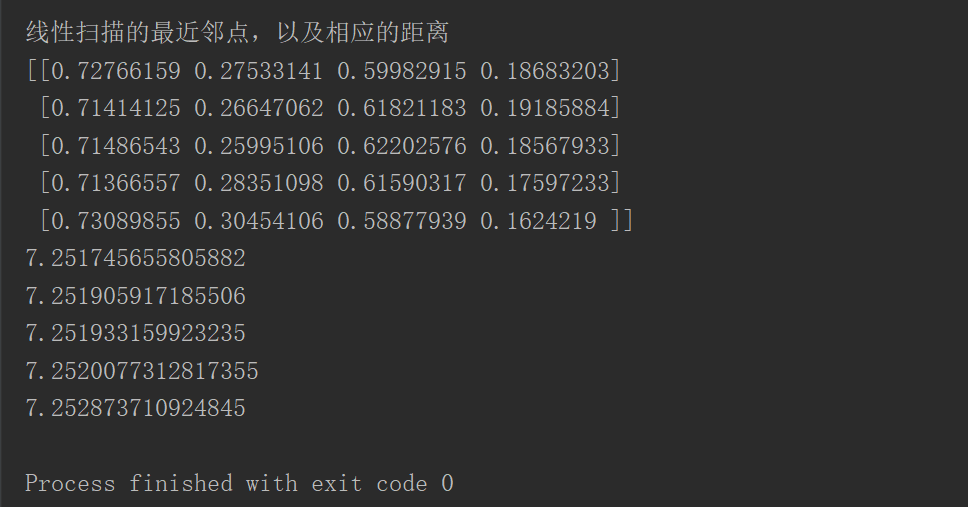

# KNN最近邻算法实现

## 基于kd树的KNN

1. 构建kd树
2. 搜索kd树

运行`/src/KNN_kdTree.py`

## 基于线性扫描的KNN

线性扫描各个训练样例与预测样例的距离，然后求出距离最小的前k个点，输出这k个点的label的多数类

运行`src/KNN_linearScan.py`

## 两种方法对比

运行`src/compare.py`

## 结果分析

基于kd树的KNN，算法波动较 基于线性扫描KNN要大一些，原因我估计是：

1. 寻找的切分轴以及切分点时,kd树并未能完全分割
2. 各个特征节点的量纲不同，有的特征取值范围大，有的取值范围小。这一点，在算法中经过对输入特征消除量纲影响后(归一化)很明显
