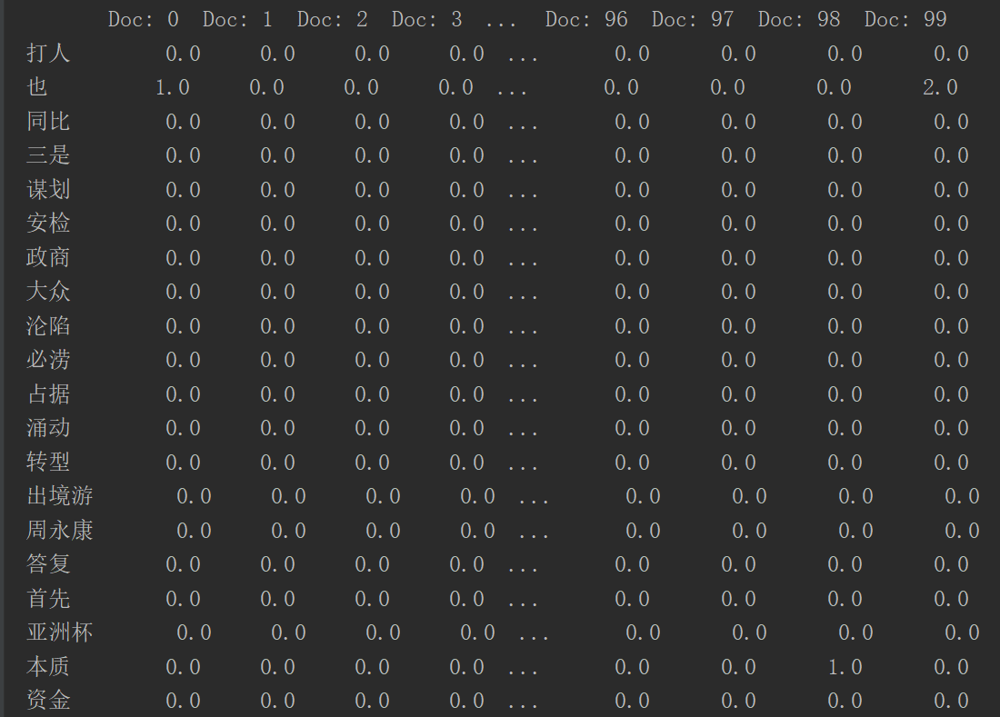
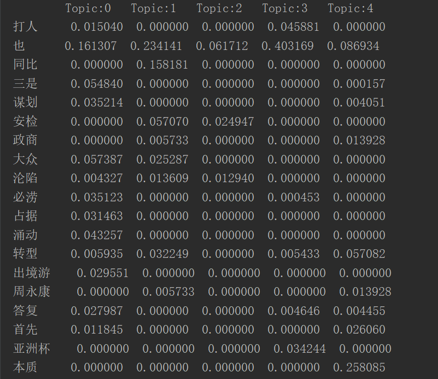
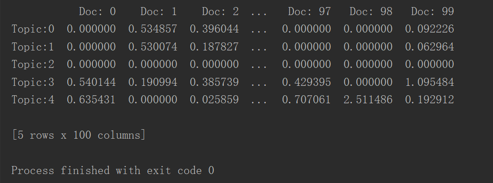
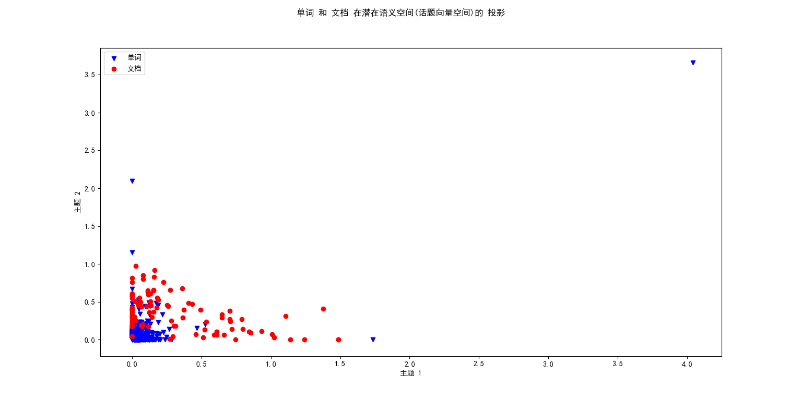
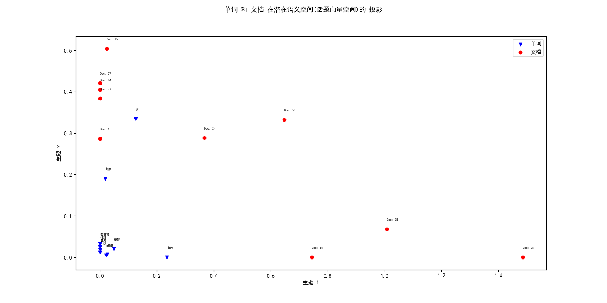

# 潜在语义分析(latent semantic analysis,LSA)

又叫 **潜在语义索引(latent semantic indexing,LSA)**

## 1. 实现方式：奇异值分解SVD

运行 `src/LSA.py` ，只需设定参数`model='SVD'`即可，在单词-文档矩阵中存储的元素可以是单词在文档中的词频，也可以是单词的 TF-IDF值，返回的`matrix_frequent`或 `matrix_tfidf` 都是`pd.DataFrame`

```Python

model = LSA(filePath=文档集路径)
model.matrix_frequent # 单词-文档矩阵元素为词频
model.matrix_tfidf #  单词-文档矩阵元素为tfidf
W,H = model.fit(model.matrix_frequent.values,n_topics=5,model='SVD')
# W 是单词-话题 矩阵，H是 话题-文档 矩阵

```

## 2. 实现方式：非负矩阵分解NMF

运行 `src/LSA.py` ，只需设定参数`model='NMF'`即可，在单词-文档矩阵中存储的元素可以是单词在文档中的词频，也可以是单词的 TF-IDF值，返回的`matrix_frequent`或 `matrix_tfidf` 都是`pd.DataFrame`

```Python

model = LSA(filePath=文档集路径)
model.matrix_frequent # 单词-文档矩阵元素为词频
model.matrix_tfidf #  单词-文档矩阵元素为tfidf
W,H = model.fit(model.matrix_frequent.values,n_topics=5,model='NMF')
# W 是单词-话题 矩阵，H是 话题-文档 矩阵

```

运行结果如下：

单词-文档矩阵X,元素为单词在文档中的词频



单词-话题矩阵W



话题-文档矩阵H



## 将单词和文档投影到潜在语义空间中的结果

这里的潜在语义空间是指话题向量空间，即将单词和文档分别用话题向量表示，选取k个主题，将单词和文档都投影到潜在语义空间内,使用时需要将H矩阵转置一下

运行`src/examples_plot.py`,结果如下：



