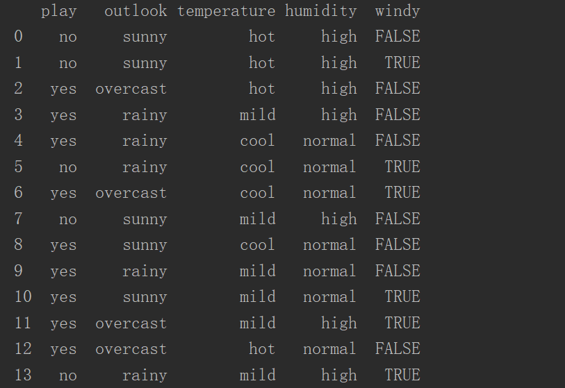
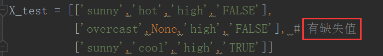
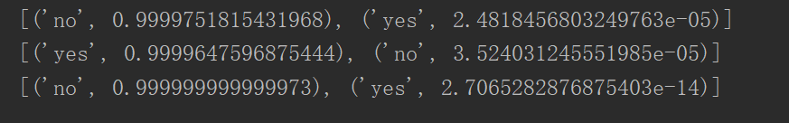

# 最大熵模型

## 要点
1. 模型只能处理离散型数据
2. 缺失值必须用None来表示
3. 训练数据中尽量不要出现缺失值，避免特征函数抽取太少
4. 预测数据中可以出现缺失值
5. 模型输入数据中特征向量的维度必须保持一致，如果缺失，就用None来表示

## 数据如下

我们用第一列来作为预测的label，表示是否出去玩耍

## 预测数据

## 预测结果

运行`src/example.py`

