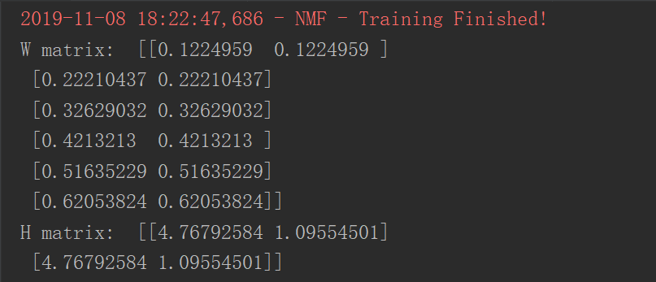
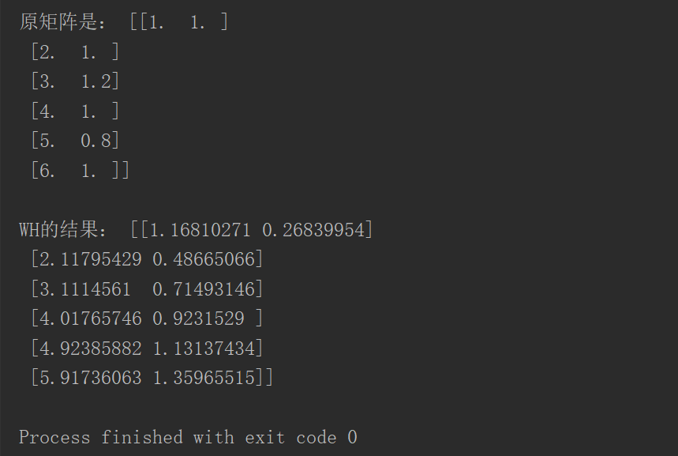
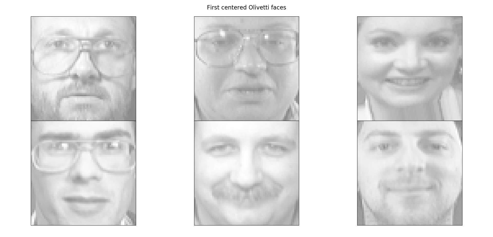
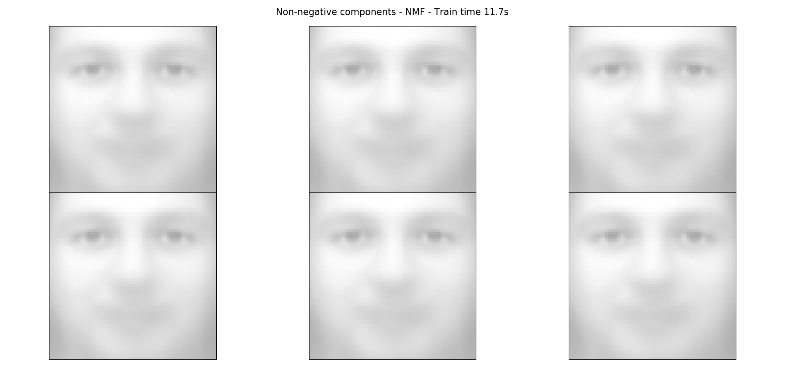
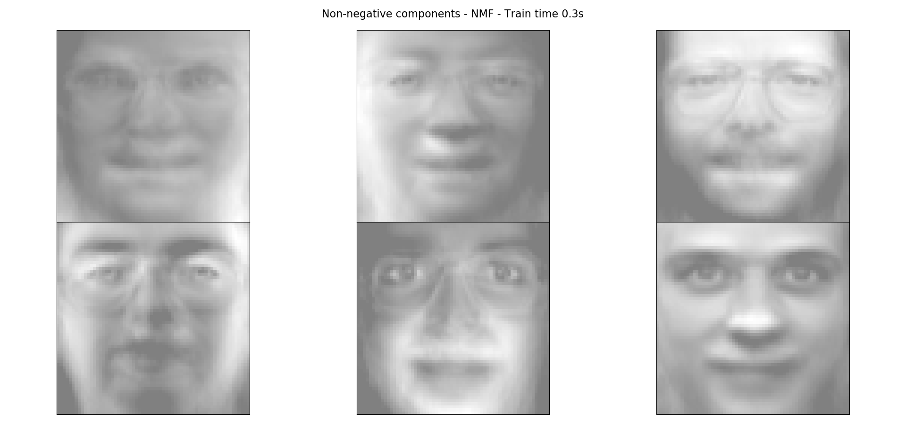

# 非负矩阵分解(Non-negative Matrix Factorization，NMF)

常用于 话题分析，数据压缩，特征抽取，是矩阵分解的一种

## 对矩阵进行NMF的结果

运行`src/NMF.py`，结果如下：

## 对图片进行NMF的结果

我们展示H矩阵，运行`src/My_NMF_examples.py`结果如下：

原始图片：

分解后代图片：

## sklearn实现的NMF的结果

我们展示H矩阵，运行`src/sklearn_NMF_example.py`结果如下：

原始图片：

分解后代图片：

