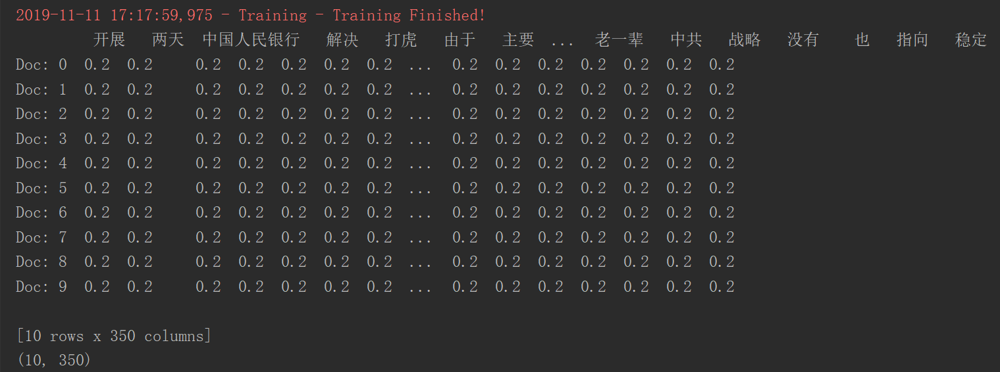
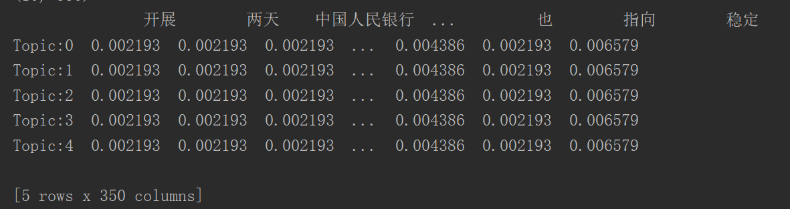
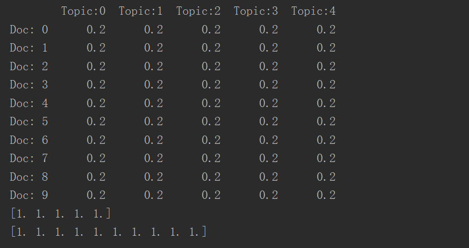
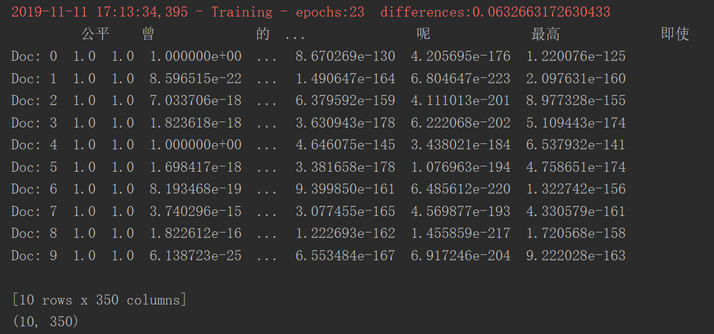
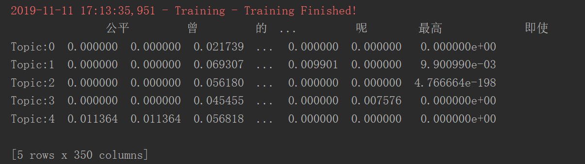
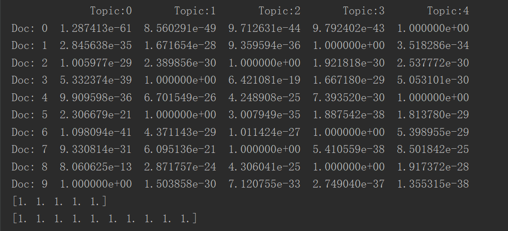

# 概率潜在语义分析(probabilistic latent semantic analysis,PLSA)

## 多层嵌套循环实现的EM算法

运行`src/PLSA_slow.py`  但 速度感人啊。。。

## 矩阵乘法实现的EM算法

运行`src/PLSA_fast.py`

### 固定初始化

固定初始化意味着话题生成单词的概率P(w_i|z_k)矩阵 和 文档生成话题的概率P(z_k|d_j) 矩阵 ，各个概率相等，并且同一话题生成的所有单词的概率之和为1，同一文档生成所有话题的概率之和为1

结果如下：

**最后那个话题下的Q函数：**

**话题生成单词的概率P(w_i|z_k)矩阵：**

**文档生成话题的概率P(z_k|d_j) 矩阵：**

### 随机初始化

随机初始化意味着话题生成单词的概率P(w_i|z_k)矩阵 和 文档生成话题的概率P(z_k|d_j) 矩阵，各个概率服从[0,1]之间的均匀分布，并且保证同一话题生成的所有单词的概率之和为1，同一文档生成所有话题的概率之和为1。

**最后那个话题下的Q函数：**

**话题生成单词的概率P(w_i|z_k)矩阵：**

**文档生成话题的概率P(z_k|d_j) 矩阵：**

### 两种初始化的问题：TODO

截止提交该代码时，笔试尚未解决：为何两种初始化方式的Q函数收敛速度差异这么大，导致最后输出的两个概率矩阵差异极大，若有哪位兄台偶尔看到该文，并且恰好明白原因，是代码的问题还是其它问题，欢迎留言告知笔者，不胜感激！
