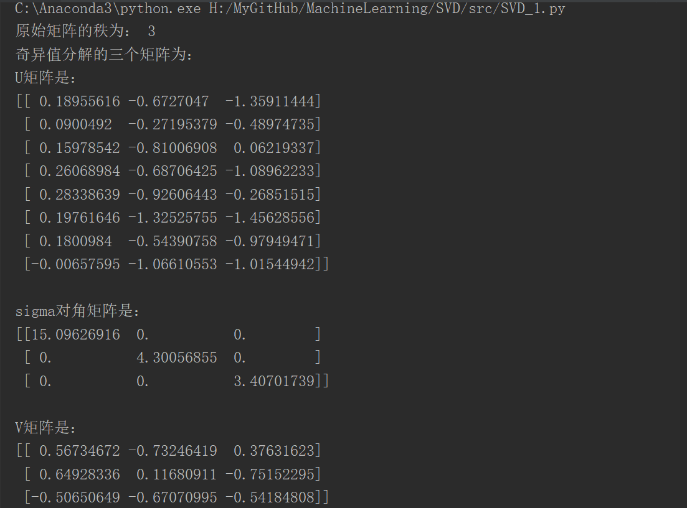
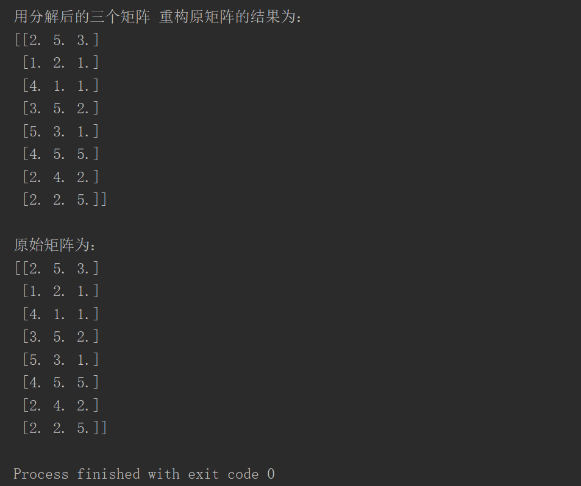

# 奇异值分解SVD

关于奇异值的讲解，在`./post`文件下有两篇很棒的博客，分别是中英文版的，同时也可以参考李航《统计学习方法第二版》奇异值分解这章。

# 分类
1. 完全奇异值分解
2. 紧奇异值分解
3. 截断奇异值分解

# 实现

## SVD_1.py

`src/SVD.py` 算法思路依照李航《统计学习方法第二版》P282页思路实现，但由于 无法解决 求A^T的零空间的一组标准正交基 ，因此 只是实现了 紧奇异值分解和截断奇异值分解。

执行结果如下：

## SVD_2.py

源于`./post`文件下有两篇很棒的博客下的两篇博客。