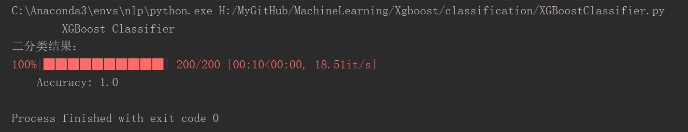
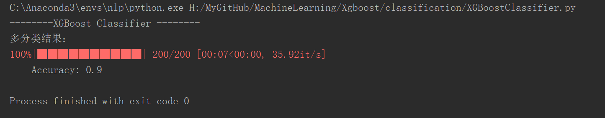
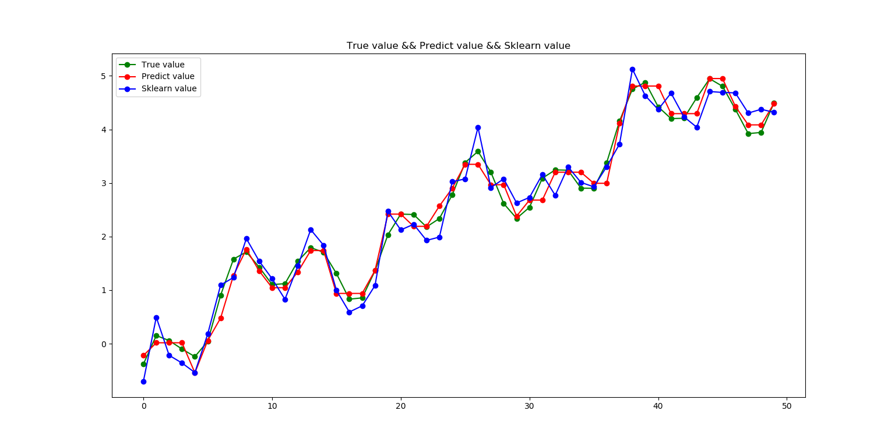

# XGBoost 算法实现

XGBoost是GBDT的工程实现，其基模型与基于CART回归树的GBDT不同，它实现的回归树，其分裂节点的准则和节点取值的方法都与CART不同。

XGBoost的回归树分裂节点的准则：最大化分裂节点前后损失函数的减少值

XGBoost的回归树节点取值的方法：w_j = - G_j / (H_j + lambda)

根据节点的取值，可以计算出当前损失函数值，有具体的公式，可以通过对损失函数在f_(t-1)(x)(上一棵树的预测值，即上一轮的基函数)处，二阶泰勒展开，然后求损失函数对节点取值的偏导，令偏导=0，即可求得使得损失函数最小的节点的取值，再代入损失函数中即可求得最小的损失函数值。

## XGBoost用于分类

XGBoost无论用于回归还是分类，其基模型都是一棵棵回归树

### XGBoost用于二分类

二分类时，损失函数用的是逻辑损失，模型输入的类别是1和0，但在模型内，需要将类别0转为类别-1，便于逻辑损失函数的一阶导数和二阶导数的计算。因此，在最后输出的预测值，我们将所有预测值大于0的预测为类别1，预测值小于等于0的预测为类别0 。

逻辑损失的公式，可查看[XGBoost](https://xgboost.readthedocs.io/en/latest/tutorials/model.html)

运行`classification/XGBoostClassifier.py`,结果如下：

### XGBoost用于多分类

多分类时，损失函数用的是交叉熵损失，模型输入的类别的格式为[label,label,label,...]，但在模型内会将类别处理为one-hot编码，便于将类别问题转为回归树可以处理的类型，即回归树需要做的就是预测one-hot各个位置的值 。因此在输出时，采用softmax，将各个维度的取值归一化，取概率值最大的索引对应的类别为预测类别。

运行`classification/XGBoostClassifier.py`,结果如下：

## XGBoost用于回归

XGBoost回归时，损失函数是均平方差，模型的输入的y值为[value,value,...]类型。

运行`classification/XGBoostRegressor.py`,结果如下：

