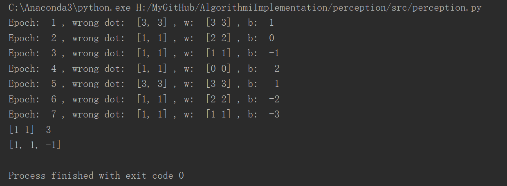
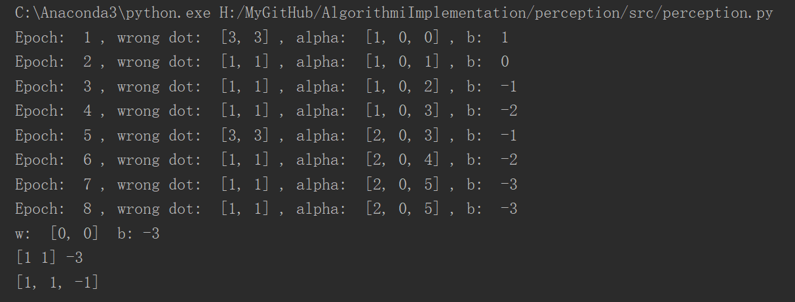

# src目录介绍

## perception.py

本模块基于李航《统计学习方法》第二章感知机，实现了感知机的原始形式和对偶形式，测试样例是书中习题。

### 1. def sign

是待学习的感知机

### 2. def loss

感知机的损失函数

### 3. def gradientDescent

梯度下降算法

### 4. def originalForm

感知机原始形式

### 5. def gram

计算Gram矩阵

### 6. def dualForm

感知机的对偶形式

