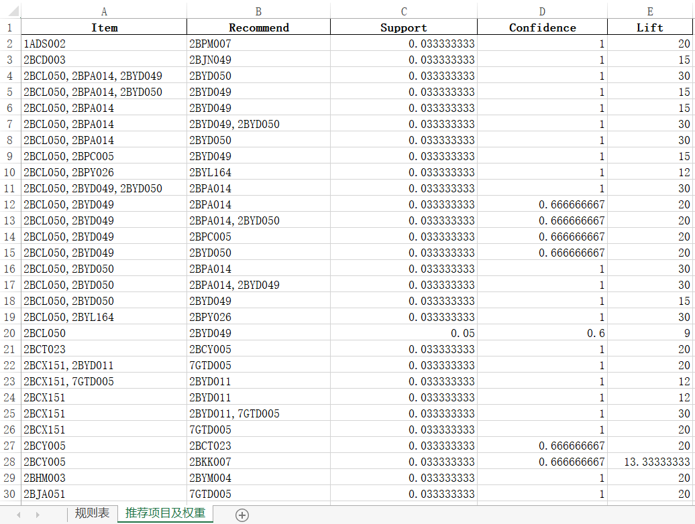
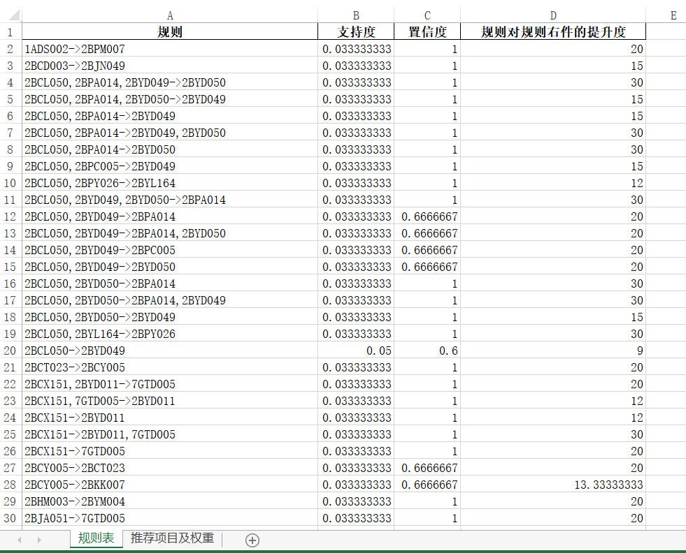
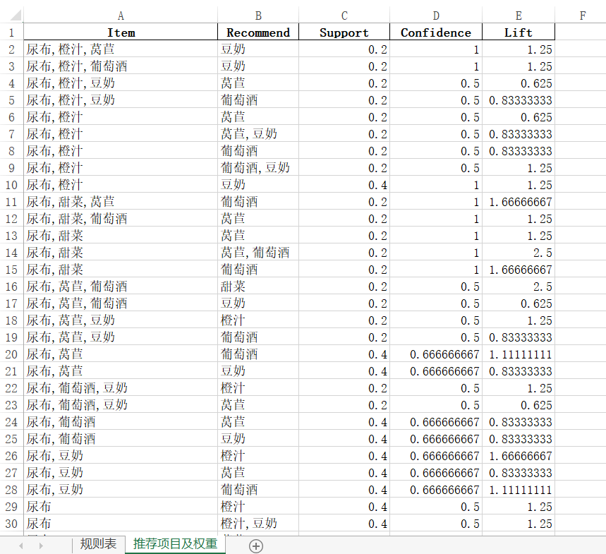
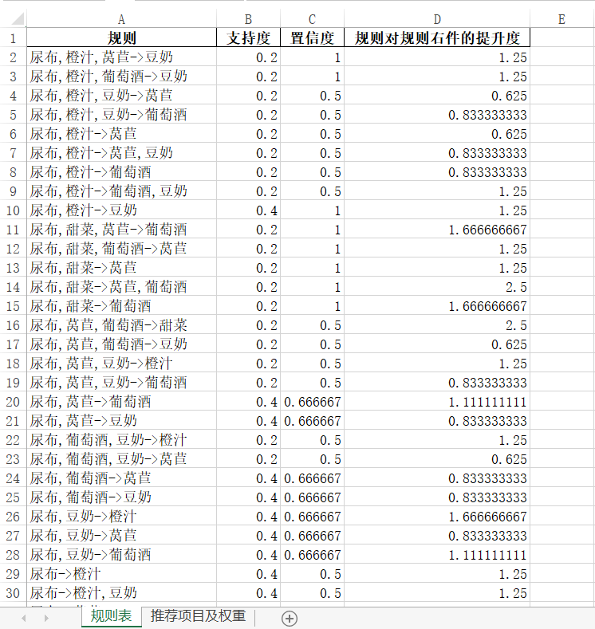

# 关联规则分析：Apriori算法

## 数据介绍

`./data/data.xlsx` 是原始数据

`./data/transaction.xlsx` 是 `./data/data.xlsx`经过处理后的数据，具体是执行`./src/process.py`

`./data/result.xlsx` 是 `./data/transaction.xlsx` 经过算法执行后的结果，具体是运行`./src/Apriori.py`

`./data/transaction2.xlsx` 是另一个数据集，经过算法执行后的结果存储在`./data/result2.xlsx`

## 结果展示

### transaction.xlsx 关联规则分析后的结果

## transaction2.xlsx 关联规则分析后的结果

