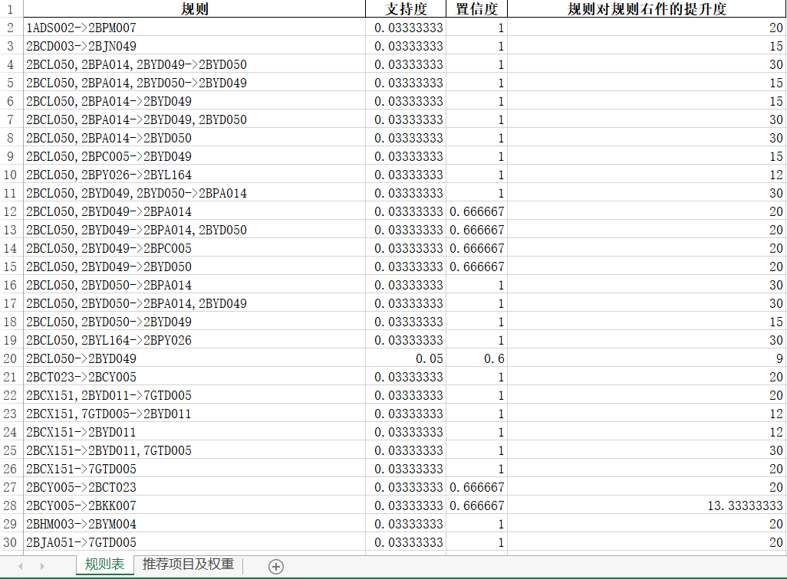
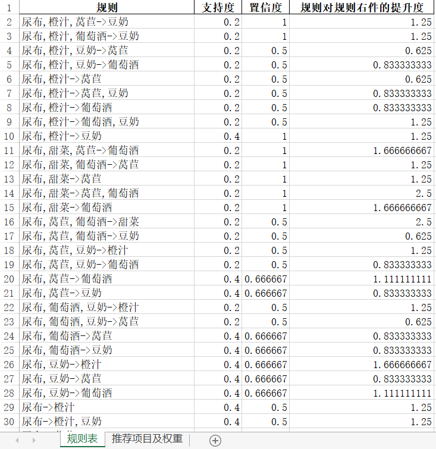
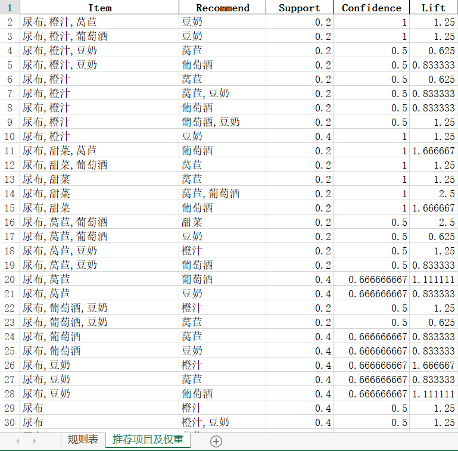
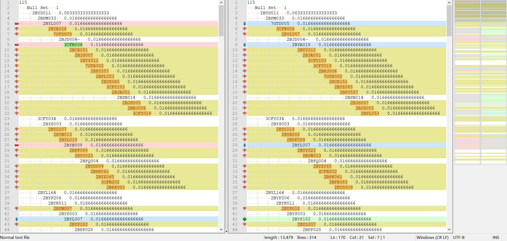
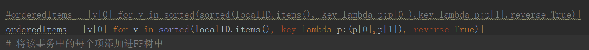
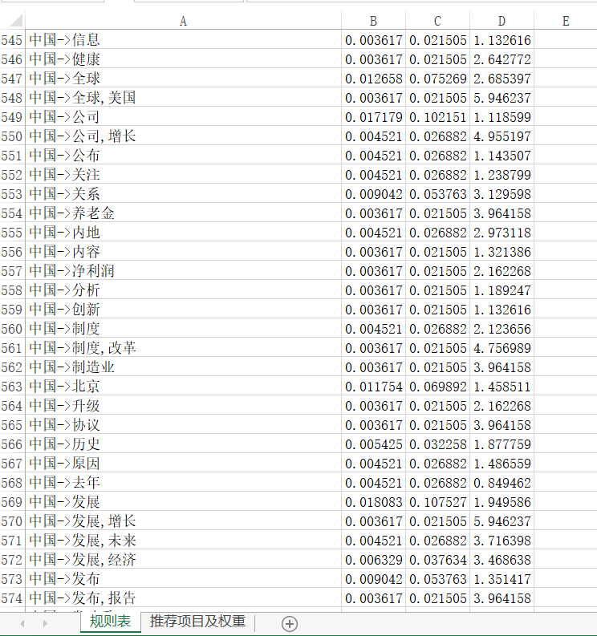
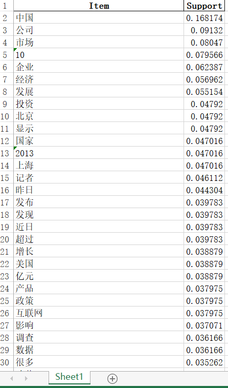

# FPGrowth算法

## 数据介绍

`./data/transaction.xlsx` 是 数据集1,经过算法执行后的结果存储在`./data/result.xlsx` ，具体是运行`src/FPGrowth_Rule.py`，但需要将程序中的输入数据路径和输出数据路径做相应的更改

`./data/transaction2.xlsx` 是 数据集2，经过算法执行后的结果存储在`./data/result2.xlsx`，具体是运行 `src/FPGrowth_Rule.py`,但需要将程序中的输入数据路径和输出数据路径做相应的更改

`./data/Article_III.txt`是LCSTS2.0 PART_III的文章列表

`./data/Article.xlsx`是经过`./src/process_lcsts.py`处理后的数据，便于`FPGrowth_LCSTS.py` 处理，处理结果存储在`./data/result3.xlsx`和`./data/words_support.xlsx`中

## 结果展示

数据集1的结果如下：

数据集2的结果如下：

## src源码介绍

`./src/FPTreeNode.py` 是FP树的结点类型

`./src/FPGrowth_Rule.py` 是基于FPGrowth算法来挖掘频繁项集，然后基于Apriori算法生成关联规则的方式来生成关联规则的算法，用来挖掘关联规则和频繁项集

`./src/FPGrowth_FreqItems.py` 是基于FPGrowth算法来挖掘频繁项集的算法实现

`process_lcsts.py`是对数据`./data/Article_III.txt`处理成算法可接受的数据格式的模块

`FPGrowth_LCSTS.py` 是挖掘`./data/Article.xlsx`频繁项集合关联规则的模块

## 实现算法遇到的坑

在构造FP树时，需要对每条事务中的项进行排序，排序是以各项的支持度为准，但是当支持度相同时，排序结果仍会出现多变，如果不进行处理，每次运行程序生成的FP树是不同的，例如如下：

两次运行程序后，FP树分别存储在`./data/t.txt`和`./data/t2.txt`中，可以去查看

并没有对当支持度相同时的排序问题处理，导致生成的FP树多变，且每次生成的频繁项集数目都不同，以下代码便是做了处理：

## 使用FPGrowth算法挖掘LCSTS2.0中PART_III中文档中的词对组合

文档数据已经事先抽取出来了，存放在`./data/Article_III.txt`中，为使抽取出来的词对组合更好一些，需要事先去除非中文字符和停用词，停用词存储在`./data/stopwords.txt`中

利用FPGrowth算法挖掘关联规则的结果为：

利用FPGrowth算法挖掘频繁项集的结果为：

## FPGrowth算法总结

FPGrowth算法是一种用于发现数据集中频繁模式的有效方法。FPGrowth算法利用Apriori原理，执行更快。Apriori算法产生候选项集，然后扫描数据集来检查它们是否频繁。由于只对数据集扫描两次，FPGrowth执行更快。

在FPGrowth算法中，数据集存储在一个称为FP树的结构中。FP树构建完成后，可以通过查找元素项的条件模式基及构建条件FP树来发现频繁项集。该过程不断以更多元素作为条件重复执行，直到FP树只包含一个元素为止。

可以利用FPGrowth算法在多种文本文档中查找频繁单词。如果对某个话题应用FPGrowth算法，便可以得到一些有关该话题的摘要信息。频繁项集生成还有其他的一些应用，比如购物交易、医学诊断及大气研究。