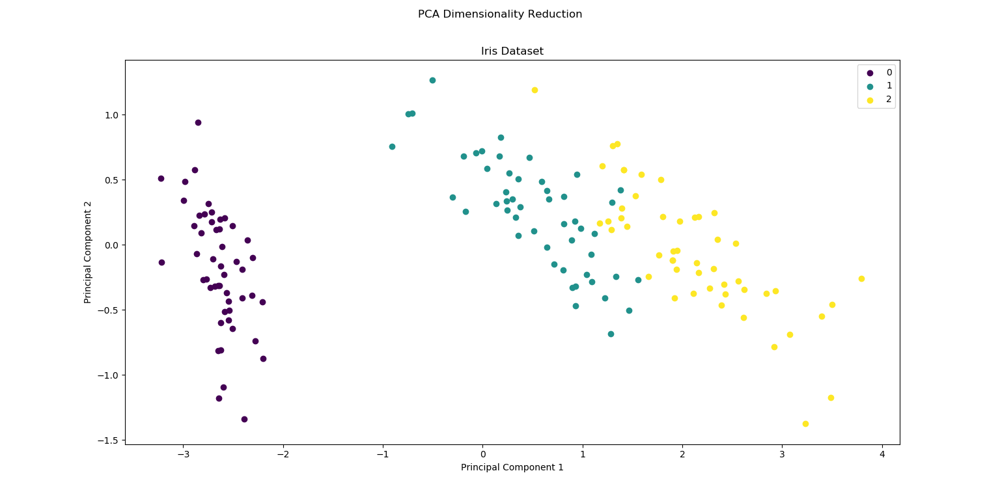
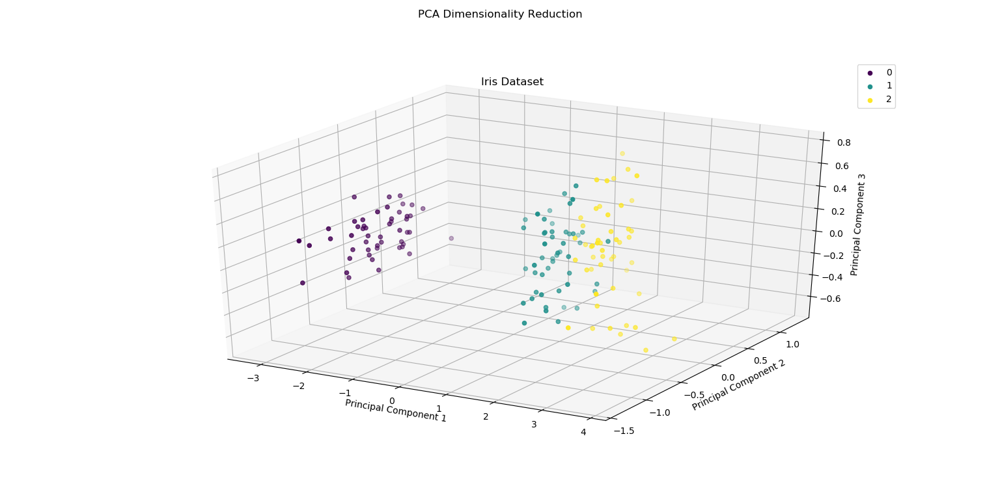
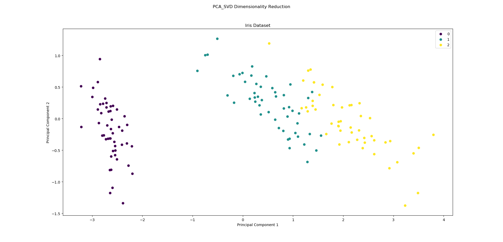
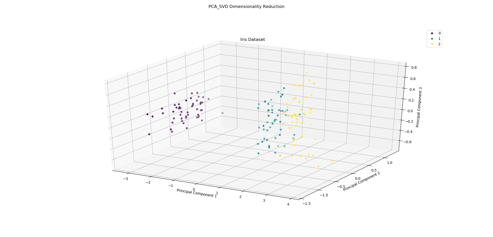

# 降维算法

## 无监督的降维算法：PCA主成分分析

PCA主成分分析：最大投影方差最大化

这里我们利用sklearn的iris数据集做展示：

### 1. 基于协方差矩阵的特征值分解算法实现的PCA

这里的协方差矩阵是原始矩阵的协方差矩阵，原始矩阵的每一列代表着一条数据，不过在程序输入时，仍然是每一行代表着一条数据，程序会自行转换。

运行程序`主成分分析PCA/src/PCA.py`

降维到二维的效果：

降维到三维的效果：

### 2. 基于矩阵奇异值分解算法实现的PCA

这里的矩阵的每一列代表着一条数据，不过在程序输入时，仍然是每一行代表着一条数据，程序会自行转换。

运行程序`主成分分析PCA/src/PCA_SVD.py`

降维到二维的效果：

降维到三维的效果：

## 有监督的降维算法：LDA线性判别分析

