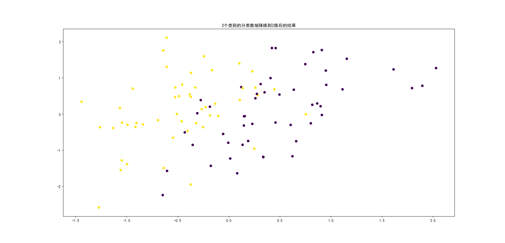
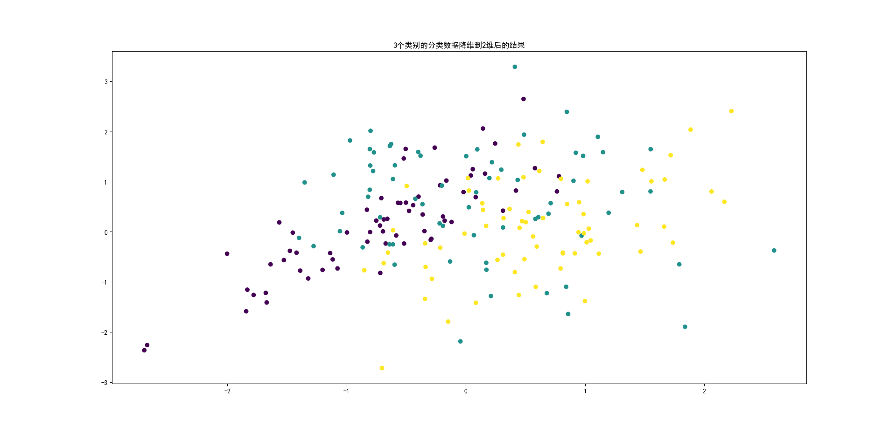
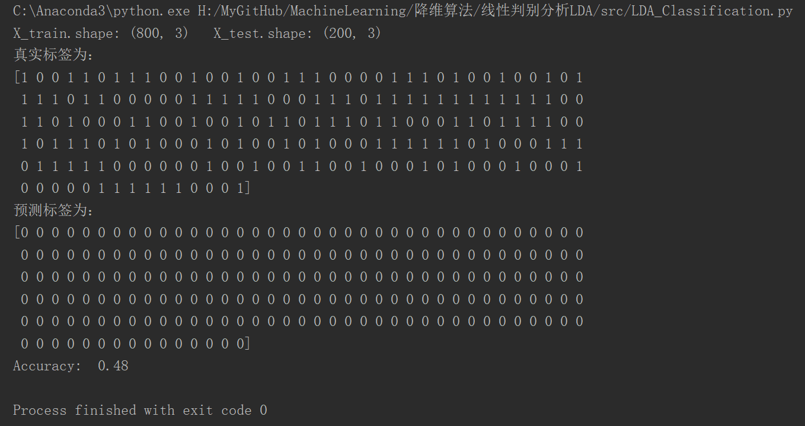
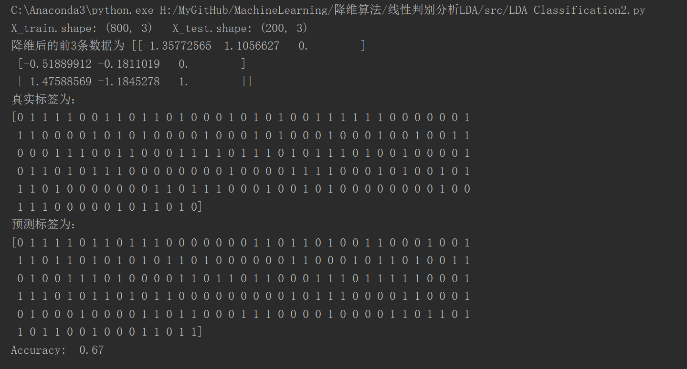

# 线性判别分析LDA

## 用于降维

运行`src/LDA.py`，结果为：

## 用于分类

### 通过计算均值向量、协方差矩阵的逆阵和协方差矩阵的行列式来估计概率，各个特征之间相互独立

运行`src/LDA_Classification.py`，结果为：

### 通过计算均值向量和方差向量来估计每个特征对应的概率，连乘后进而估计概率，各个特征之间相互独立

运行`src/LDA_Classification2.py`，结果为：

# 结论

用LDA降维后效果还可以，用来做分类的话，效果不是很理想，具体实现还有待进一步改进